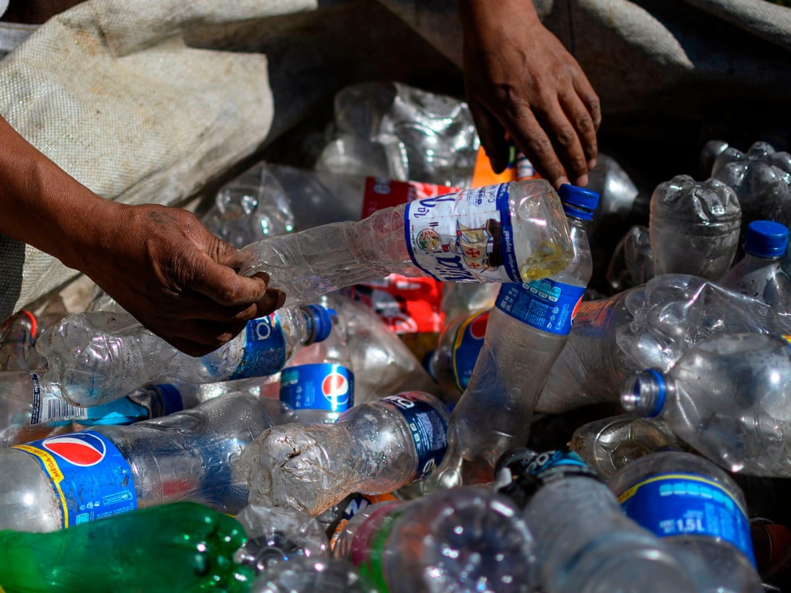

### Summary
This project utilizes plastic data provided by [TidyTuesday](https://github.com/rfordatascience/tidytuesday/tree/master/data/2021/2021-01-26) and the organization [Break Free From Plastic](https://www.breakfreefromplastic.org/about/#). To create this visualization, I downloaded country latitude/longitude data and merged it with the plastics data set by “country”. I also downloaded data for a base map. Initially, my base map and points did not line up correctly. I thought this was a problem with the data I downloaded, so I kept searching for different data and learned about different packages (jsonlite, geojsonR, leaflet), functions, and data types (geojson). After all of that, I realized that I just needed to switch the order of c(“latitude”, “longitude”) to c(“longitude”, “latitude”) when converting the merged csv to a shapefile. This is so that longitude is recognized as x and latitude as y. Another troubleshooting problem I ran into was that not all of the countries showed up in the merged data frame, so I needed to go back and make sure all of the country names matched between the data frames. 

#### **Main Takeaways**
- How to merge spatial data with a csv file by a column. 
    - Always make sure longitude is in the x position and latitude is in the y position.
    - Also make sure everything in a column matches for a merge. 
- How to customize maps, using theme (panel.grid.major, panel.background, panel.border) and coord_sf(xlim, ylim).


```{r setup, include=FALSE}
knitr::opts_chunk$set(echo = TRUE, warning = FALSE, message = FALSE)
library(tidyverse)
library(maptools)
library(sf)
library(raster)
library(tmap)
library(here)
library(dplyr)
library(jsonlite)
library(geojsonR)
library(rgdal)
library(data.table)
library(leaflet)
library(janitor)
```

### Wrangling the Data
```{r}
# read in the data
plastics <- readr::read_csv('https://raw.githubusercontent.com/rfordatascience/tidytuesday/master/data/2021/2021-01-26/plastics.csv') %>% 
  dplyr::select(!grand_total) %>% 
  pivot_longer(cols = 5:11, names_to = "plastics", values_to = "counts") %>% 
  filter(year == 2020) %>% 
  filter(str_detect(parent_company, "Pepsi")) %>% 
  filter(parent_company == "Pepsico") %>% 
  dplyr::select(!volunteers) %>% 
  dplyr::select(!empty) %>% 
  dplyr::select(!num_events) %>%
  mutate(country = case_when(
    country == "United States of America" ~ "United States",
    country == "United Kingdom of Great Britain & Northern Ireland" ~ "United Kingdom",
    country == "Korea" ~ "South Korea",
    TRUE ~ as.character(country)
  ))

# read in the data
country_lat_long <- read_csv("world_country_and_usa_states_latitude_and_longitude_values.csv") %>% dplyr::select(country, latitude, longitude)

world_map <- read_sf("99bfd9e7-bb42-4728-87b5-07f8c8ac631c2020328-1-1vef4ev.lu5nk.shp") %>% clean_names() %>% 
  rename("country" = "cntry_name")

world_countries_map <- read_sf("World_Countries__Generalized_.shp") %>% 
  clean_names()

# merge the data
merged_data <- merge(plastics, world_countries_map, by = "country")

merge_2 <- merge(merged_data, country_lat_long, by = "country")

```

### Transforming to Shapefile and Setting CRS
```{r}
data_shapefile <- st_as_sf(merge_2, coords = c("longitude", "latitude"))

st_transform(world_countries_map, 4326)

st_crs(data_shapefile) = 4326
```

### Creating the Map
```{r}
ggplot()+
  geom_sf(data = world_countries_map, size = 0.5, color = "darkgray", fill = "antiquewhite1") +
  geom_sf(data = data_shapefile, aes(size = counts), color = "dodgerblue4") +
  theme(panel.grid.major = element_line(colour = gray(0.5), linetype = "dashed", 
         size = 0.5), panel.background = element_rect(fill = "aliceblue"), 
         panel.border = element_rect(fill = NA)) +
  labs(x = "Longitude",
       y = "Latitude",
       title = "Pepsi Plastic Found Around the World by Break Free from Plastic, 2020") +
  coord_sf(xlim = c(-180, 180), ylim = c(-90, 90), expand = FALSE)
```

