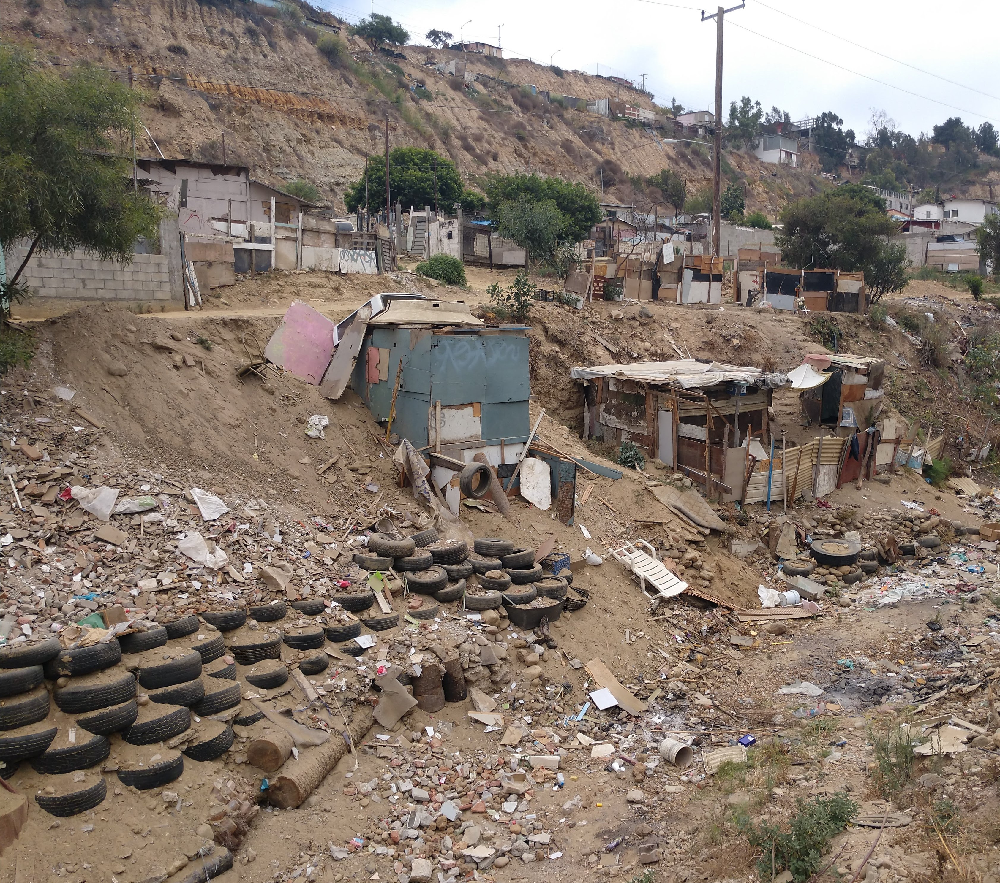

 

In my free time, I love surfing, playing soccer, hiking, traveling, and baking/cooking! I am interested in using data and spatial analysis to understand social ecological issues. I am specifically interested in focusing on Latin America and working on my Spanish skills.  

I have experience interning with the UCSD Center for Global Justice in Tijuana, Mexico. This internship focused on social ecological issues, such as illegal dumping and erosion due to irregular development in Los Laureles Canyon. When it rains, this canyon often floods and sends sediment and trash into the Tijuana Estuary. Below is an image of an erosion hot spot in Los Laureles canyon.

I also had a sustainability internship at Gaia Servicios Ambientales in Medellín, Colombia, where I improved my conversational Spanish skills. I have experience assisting in GIS research at the Scripps Institution of Oceanography focused on Mexico. 

